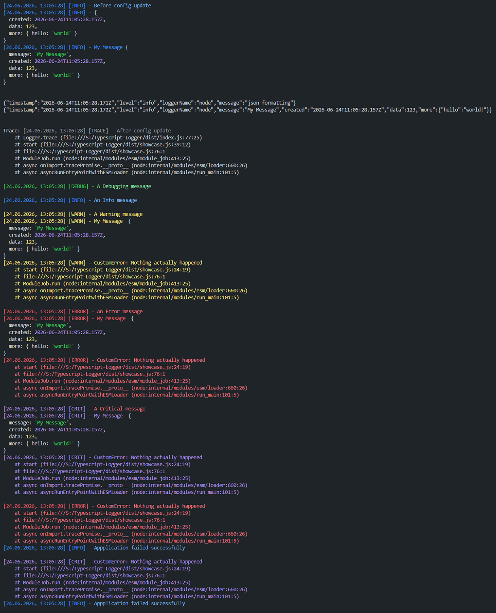

# EZ Typescript Logger

A simple to use Logger for Typescript


## Install

```console
npm i -S ez-ts-logger
```

## Usage

```typescript
import Logger from 'ez-ts-logged'

Logger.debug('A Debugging message')
Logger.info(anObject)
Logger.warn('A Warning message')

Logger.error('An Error message')
Logger.error(new Error())

try {
  Logger.errorAndThrow(new Error())
} catch (e) {
  // Caught
}
```

## Configuration

EZ Typescript Logger automatically gets its configuration from env vars (or default if undefined)

```dotenv

# 'trace', 'debug', 'info', 'warning', 'error' or 'critical'
LOG_LEVEL=info

# 'text', 'json' (json formatting for Loki/Promtail/Grafana and such)
LOG_OUTPUT=text

# If 'true', will suppress all logs (used when running unit test)
TESTING=false

# If 'true', ignores log level when printing 'debug' message (always prints it)
DEBUGGING=false
```

## Full features

### Showcase script

```typescript
const object = {
  created: new Date(),
  data: 123,
  more: {
    hello: 'world',
  },
}
const objectWithMessage = {
  message: 'My Message',
  created: new Date(),
  data: 123,
  more: {
    hello: 'world!',
  },
}

const error = new CustomError('Nothing actually happened')

//Just some spacing for readibility
console.log()
console.log()

Logger.info('Before config update')
Logger.info(object)
Logger.info(objectWithMessage)

Logger.changeConfigs({ LOG_OUTPUT: 'json', LOG_LEVEL: LoggerLevels.trace })
console.log()
console.log()

Logger.info('json formatting')
Logger.info(objectWithMessage)

console.log()
console.log()

Logger.changeConfigs({ LOG_OUTPUT: 'text' })

Logger.trace('After config update')
console.log()

Logger.debug('A Debugging message')
console.log()

Logger.info('An Info message')
console.log()

Logger.warn('A Warning message')
Logger.warn(objectWithMessage)
Logger.warn(error)
console.log()

Logger.error('An Error message')
Logger.error(objectWithMessage)
Logger.error(error)
console.log()

Logger.critical('A Critical message')
Logger.critical(objectWithMessage)
Logger.critical(error)
console.log()

try {
  Logger.errorAndThrow(error)
} catch (e) {
  Logger.info(`Appplication failed successfully`)
} finally {
  console.log()
}

try {
  Logger.criticalAndThrow(error)
} catch (e) {
  Logger.info(`Appplication failed successfully`)
} finally {
  console.log()
}
```

### Showcase output


